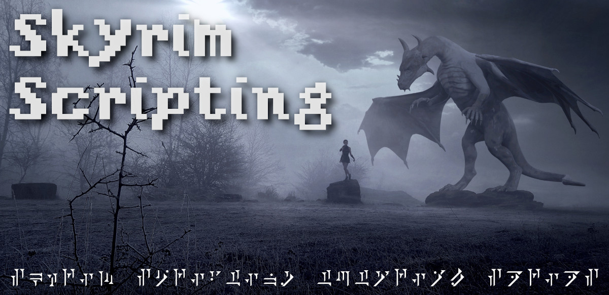

> _A series of tutorial screencasts_

---

# Code

The code for each screencast can be found here.

More info coming soon.

# Libraries

Libraries which this screencast series will cover:

- SKSE
- Papyrus Utils
- Papyrus Extender
- JContainers
- UI Extensions
- Console Util

# Series

## Part 1 - Introduction

- Screencast series introduction

## Part 2 - Mod Anatomy and SSEEdit

- Install a mod
- See it run
- Look at its anatomy
- Edit it
- See our edits

Notes:

- [Nexus Mods](https://www.nexusmods.com/)
- [Skyrim Special Editition Mods](https://www.nexusmods.com/skyrimspecialedition)
- [Alternate Start](https://www.nexusmods.com/skyrimspecialedition/mods/272)
- `BSA` Bethesda Softworks Archive (BSARC Compression)
- [BAE (Bethesda Archive Extractor)](https://www.nexusmods.com/skyrimspecialedition/mods/974)
- `ESM` Elder Scrolls Master
- `ESP` Elder Scrolls Plugin
- `ESL` Light Master
- [SSEEdit](https://www.nexusmods.com/skyrimspecialedition/mods/164/)
- `C:\Program Files (X86)\Steam\Steamapps\Common\Skyrim Special Edition\Data`
- `C:\Users\[USER]\AppData\Local\Skyrim Special Edition\plugins.txt`
- `C:\Users\[USER]\Documents\My Games\Skyrim Special Edition\Skyrim.ini`
- `C:\Users\[USER]\Documents\My Games\Skyrim Special Edition\Saves\`

## Part 3 - Hello, Creation Kit!

- [Bethesda Launcher](https://bethesda.net/en/game/bethesda-launcher)
- `regsvr32 "C:\Program Files (X86)\Steam\Steamapps\Common\Skyrim Special Edition\Data<path to skyrim>\flowchartx64.dll"`
- [Custom Tweaked Ini](https://www.nexusmods.com/skyrimspecialedition/mods/19817/)

## Part 4 - Mod Managers

- [Mod Organizer 2](https://www.modorganizer.org/)
- [Vortex](https://www.nexusmods.com/about/vortex/)

## Part 5 - Modding in Git

## Part 6 - Papyrus Primer

- Visual Studio Code
- Enable Logging

## Part 7 - SKSE

## Part 8 - Integrating Multiple Mods

- Mod Events

## Other

- Viewing script variables on savegames
- Create LAL Scenario
- Create console command
- Share via Nexus Mods as ESL esp and BSA
