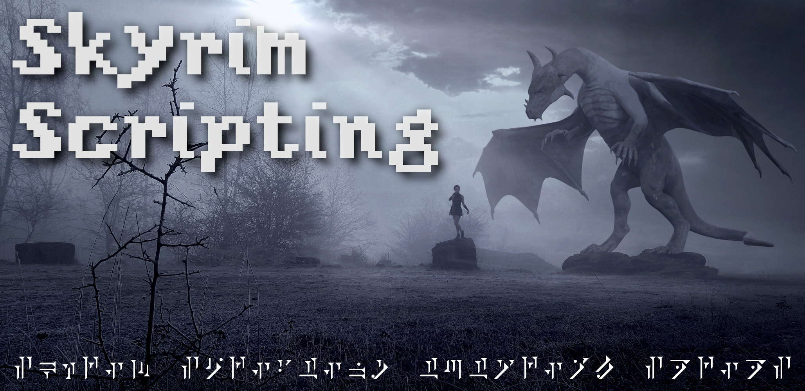

> _Idea for a new episode? [Submit a request here!](https://github.com/mrowrpurr/SkyrimScripting/issues/new?assignees=&labels=&template=new-episode-request.md&title=Episode+Request)_

> _A series of tutorial screencasts_

---

👋 Hey y'all, [@mrowrpurr](https://github.com/mrowrpurr) here.

I'm a new Skyrim modder ( _long time software developer_ )

I want to share with you everything that I'm learning in my Skyrim modding journey 🛣️

# Skyrim Scripting

As a programmer, I am in love with the programming aspects of authoring mods!

Hence the screencast series name, "_**Skyrim Scripting**_"

I have a couple of goals with this screencasting series:

1. Get y'all setup to create your **first mod** easily ( _in less than 20 minutes_ )
2. Get y'all an _efficient_ and _enjoyable_ **local development environment** ( _with debugging tools_ )
3. Get y'all acquainted with some of the **most common modding tools** which you'll need
4. Get y'all **super comfortable** making new simply mods _really quickly_ and _painlessly_
5. Get y'all posting your mods to **GitHub**, **Nexus Mods**, and other sites
6. Teach y'all some of the **basics** _as I learn them myself!_
7. Share various miscellaneous videos, mostly creating **libraries and utilities** for other modders!

# Ready?

Ok, let's go!

# Series 1: Intro to Skyrim Scripting

1. Intro to Skyrim Scripting
2. Install Skyrim outside of Program Files
3. Install Creation Kit and make a mod
4. Write mods using Vortex and Mod Organizer 2
5. Writing Scripts outside of Creation Kit
6. Write Scripts using SKSE (Skyrim Script Extender)
7. Using the Skyrim Script Debugger and Log Viewer
8. Skyrim Script Basics (Papyrus)
9. Lots of Common Skyrim Modder Tools
10. Ready for Adventure!

# Series 2: Common Modding Libraries

- [ ] Papyrus Util
- [ ] UI Extensions
- [ ] Console Util
- [ ] Papyrus Extender
- [ ] iWant Widgets

# Miscellaneous

- [ ] Player Scripts
- [ ] Crosshair Inspector
- [ ] Keyboard Shortcuts
- [ ] Custom Console Commands
- [ ] Custom Mod Events
- [ ] Detecting Other Installed Mods
- [ ] .ini Configuration Files
- [ ] .json Configuration Files
- [ ] Summon Hirelings Mod

# Series Wishlist

- Papyrus Basics
- Create SKSE Plugin
- Create .NET Script Framework Plugin
- Create Flash Widgets
